# Airport Traffic Dashboard Tutorial

By the end of this tutorial, you will have created a dashboard that estimates the time it takes to get to the airport from different parts of a city.

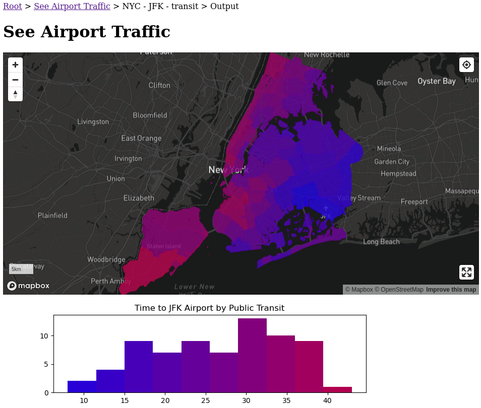

- [Work through this tutorial online](https://crosscompute.net/a/learn-examples-in-jupyterlab?repository_uri=https://github.com/crosscompute/crosscompute-docs/tree/master/docs/automation-framework/tutorials/airport-traffic&environment_text=GOOGLE_KEY=YOUR-GOOGLE-KEY). You will need a valid `GOOGLE_KEY` enabled with the [Distance Matrix API](https://developers.google.com/maps/documentation/distance-matrix) for Phase 3 of the tutorial.
- [You can see the dashboard here](https://crosscompute.net/a/see-airport-traffic).
- [Here is the code for the dashboard](https://github.com/crosscompute/crosscompute-examples/tree/master/dashboards/airport-traffic).
- [Here is the code for this tutorial](https://github.com/crosscompute/crosscompute-docs/tree/master/docs/automation-framework/tutorials/airport-traffic).

If you are using your own machine, install the following packages and environment variables. For `GOOGLE_KEY`, please enable the [Distance Matrix API](https://developers.google.com/maps/documentation/distance-matrix).

```bash
pip install \
    jupyterlab-crosscompute \
    crosscompute-views-map \
    h3 \
    matplotlib \
    requests \
    shapely
export MAPBOX_TOKEN=YOUR-MAPBOX-TOKEN
export GOOGLE_KEY=YOUR-GOOGLE-KEY
jupyter lab
```

## Phase 0: Plan Dashboard Variables

The first step is to decide what variables you want to show in your dashboard.

1. Configure automation
2. Define batches
3. Add styles
4. Add scripts

### Create Automation

We have three input variables and two output variables. If you are starting from scratch, save this configuration in a file called `automate.yml`.

```yaml
---
crosscompute: 0.9.2
name: See Airport Traffic
description: See how long it takes to get to the airport from different parts of a city
version: 0.0.1

input:
  variables:
    - id: districts_uri
      view: string
      path: variables.dictionary
    - id: destination_address
      view: string
      path: variables.dictionary
    - id: travel_mode
      view: string
      path: variables.dictionary

output:
  variables:
    - id: districts_map
      view: map-mapbox
      path: map.geojson
      configuration:
        style: mapbox://styles/mapbox/dark-v10
        layers:
          - type: fill
            paint:
              fill-color: ['interpolate', ['linear'], ['get', 't'], 0, 'blue', 60, 'red']
              fill-opacity: 0.8
    - id: time_histogram
      view: image
      path: histogram.png

batches:
  - folder: batches/{city_name | slug}-{destination_name | slug}-{travel_mode | slug}
    name: '{city_name} - {destination_name} - {travel_mode}'
    slug: '{city_name | slug}-{destination_name | slug}-{travel_mode | slug}'
    configuration:
      path: datasets/batches.csv

scripts:
  - path: run.ipynb

environment:
  interval: 8 hours

display:
  styles:
    - path: style.css
  pages:
    - id: automation
      configuration:
        design: output
    - id: output
      configuration:
        design: none
```

### Define Batches

In `automate.yml`, there is a section that defines the batches for your automation. Batches are pre-defined runs.

```yaml
batches:

  - folder: batches/{city_name | slug}-{destination_name | slug}-{travel_mode | slug}

    # Set batch name
    name: '{city_name} - {destination_name} - {travel_mode}'

    # Set batch uri
    slug: '{city_name | slug}-{destination_name | slug}-{travel_mode | slug}'

    # Configure batch variables from a file
    configuration:
      path: datasets/batches.csv
```

Create a folder called `datasets`. Then, create a file called `batches.csv` in the `datasets` folder. These batches run automatically.

```csv
city_name,districts_uri,destination_name,destination_address,travel_mode
NYC,"https://services5.arcgis.com/GfwWNkhOj9bNBqoJ/arcgis/rest/services/NYC_Community_Districts/FeatureServer/0/query?where=1=1&outFields=*&outSR=4326&f=pgeojson",JFK,"JFK Airport",transit
NYC,"https://services5.arcgis.com/GfwWNkhOj9bNBqoJ/arcgis/rest/services/NYC_Community_Districts/FeatureServer/0/query?where=1=1&outFields=*&outSR=4326&f=pgeojson",JFK,"JFK Airport",driving
NYC,"https://services5.arcgis.com/GfwWNkhOj9bNBqoJ/arcgis/rest/services/NYC_Community_Districts/FeatureServer/0/query?where=1=1&outFields=*&outSR=4326&f=pgeojson",LGA,"LGA Airport",transit
NYC,"https://services5.arcgis.com/GfwWNkhOj9bNBqoJ/arcgis/rest/services/NYC_Community_Districts/FeatureServer/0/query?where=1=1&outFields=*&outSR=4326&f=pgeojson",LGA,"LGA Airport",driving
NYC,"https://services5.arcgis.com/GfwWNkhOj9bNBqoJ/arcgis/rest/services/NYC_Community_Districts/FeatureServer/0/query?where=1=1&outFields=*&outSR=4326&f=pgeojson",EWR,"EWR Airport",transit
NYC,"https://services5.arcgis.com/GfwWNkhOj9bNBqoJ/arcgis/rest/services/NYC_Community_Districts/FeatureServer/0/query?where=1=1&outFields=*&outSR=4326&f=pgeojson",EWR,"EWR Airport",driving
```

### Add Styles

In `automate.yml`, styles are part of the display configuration.

```yaml
display:

  styles:

    # Define styles using CSS
    - path: style.css

  pages:

    # Set the automation page to show the output of the first batch
    - id: automation
      configuration:
        design: output

    # Remove default design for output page
    - id: output
      configuration:
        design: none
```

Create a file called `style.css`.

```css
.districts_map {
  height: 50vh;
}
._image {
  max-width: 100%;
}
```

You can style your views using CSS for variable names or view names. Note that view names are prefixed by an underscore.

### Add Scripts

Create a notebook and name it `run.ipynb`.

Click the CrossCompute logo on the right to open the CrossCompute sidebar, then click Launch to start the development server.

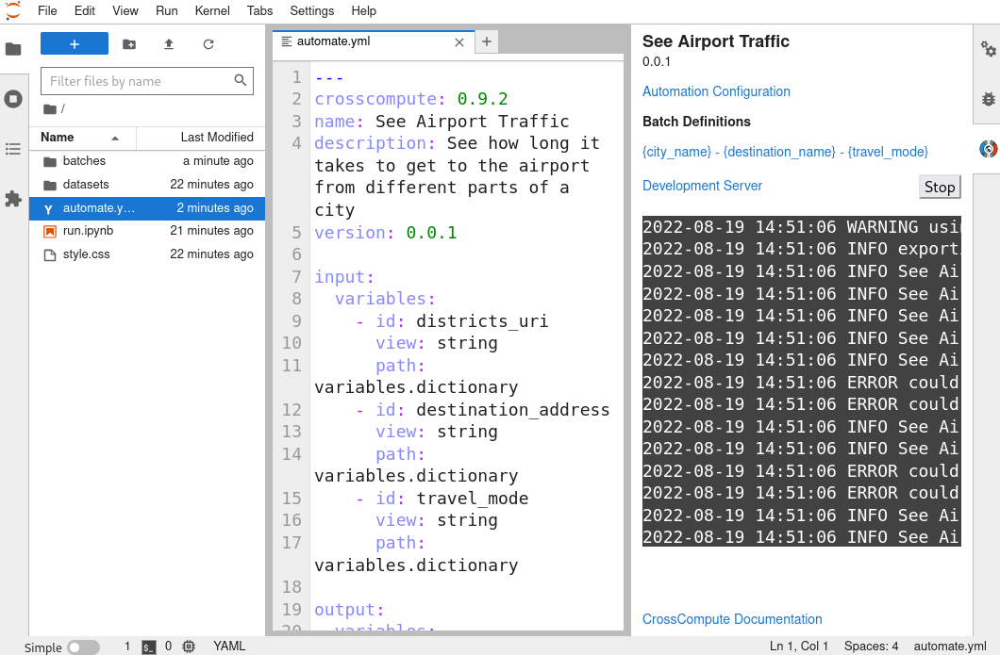

## Phase 1: Prepare Simplified Polygons

Now let's draw the polygons that we will color in our choropleth map.

0. Prepare inputs.
1. Download polygons.
2. Simplify features.
3. Save polygons.

### Prepare Inputs

Create the following file structure.

```
tests
  standard
    input
	  variables.dictionary
```

Save the following data in `variables.dictionary`.

```
{"districts_uri": "https://services5.arcgis.com/GfwWNkhOj9bNBqoJ/arcgis/rest/services/NYC_Community_Districts/FeatureServer/0/query?where=1=1&outFields=*&outSR=4326&f=pgeojson", "destination_address": "JFK Airport", "travel_mode": "transit"}
```

Open `run.ipynb`. Get the input and output folders at the top of the notebook.

```python
from os import getenv
from pathlib import Path

input_folder = Path(getenv(
    'CROSSCOMPUTE_INPUT_FOLDER', 'tests/standard/input'))
output_folder = Path(getenv(
    'CROSSCOMPUTE_OUTPUT_FOLDER', 'tests/standard/output'))

output_folder.mkdir(parents=True, exist_ok=True)
```

Load your input variables.

```python
import json

with (input_folder / 'variables.dictionary').open('rt') as f:
    d = json.load(f)
districts_uri = d['districts_uri']
```

### Download Polygons

```python
from pathlib import Path
from urllib.request import urlretrieve as download_uri

districts_path = output_folder / 'raw.geojson'
download_uri(districts_uri, districts_path)
```

```bash
ls datasets -l -h
```

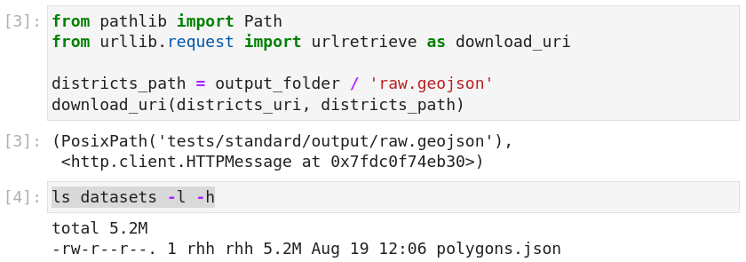

Note that the raw download is over 5mb. As the district polygons are not likely to change significantly, we can cache the downloaded file to speed subsequent runs. We hash the uri to get a mostly unique filename, then we check whether the file has already been processed before attempting to download it.

```python
from hashlib import blake2b

def get_hash(text):
    h = blake2b()
    h.update(text.encode())
    return h.hexdigest()
```

```
import json
from urllib.request import urlretrieve as download_uri

datasets_folder = Path('datasets')
raw_path = (
    datasets_folder / 'districts' / get_hash(districts_uri)
).with_suffix('.raw')
if not raw_path.exists():
    raw_path.parent.mkdir(parents=True, exist_ok=True)
    download_uri(districts_uri, raw_path)
with raw_path.open('rt') as f:
    d = json.load(f)
    features = d['features']
districts_geojson = d
len(features)
```

We could map our polygons at this point, but requiring users to download a 5mb geojson will cause slower connections to lag. In the next section, we will simplify the polygons.

### Simplify Polygons

```python
import json

with districts_path.open('rt') as f:
    districts_geojson = json.load(f)
features = districts_geojson['features']
len(features)
```

```python
from shapely.geometry import shape

feature = features[0]
polygon = shape(feature['geometry'])
print(len(polygon.wkt))
polygon
```

```python
simplified_polygon = polygon.simplify(0.001)
print(len(simplified_polygon.wkt))
simplified_polygon
```

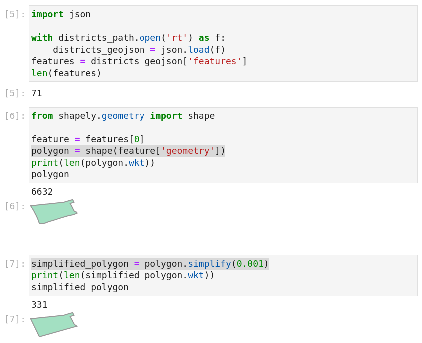

To speed subsequent runs, we can cache the simplified polygons. Let's combine the above steps to save our simplified polygons.

```python
from shapely.geometry import mapping

for feature in features:
    polygon = shape(feature['geometry'])
    simplified_polygon = polygon.simplify(0.001)
    feature['geometry'] = mapping(simplified_polygon)
```

```python
import json
from urllib.request import urlretrieve as download_uri

SIMPLIFICATION_TOLERANCE = 0.001

datasets_folder = Path('datasets')
districts_path = (
    datasets_folder / 'districts' / get_hash(districts_uri)
).with_suffix('.json')
if not districts_path.exists():
    districts_path.parent.mkdir(parents=True, exist_ok=True)
    raw_path = districts_path.with_suffix('.raw')
    download_uri(districts_uri, raw_path)
    with raw_path.open('rt') as f:
        d = json.load(f)
        d['features'] = features = [simplify_feature(
            _, SIMPLIFICATION_TOLERANCE) for _ in d['features']]
    with districts_path.open('wt') as f:
        json.dump(d, f)
else:
    with districts_path.open('rt') as f:
        d = json.load(f)
        features = d['features']
districts_geojson = d
len(features)
```

```bash
ls $districts_path.parent -l -h
```

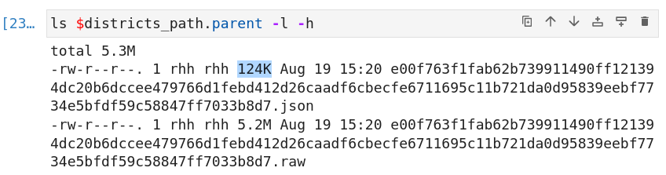

Simplifying the polygons reduced our geojson size to a much more manageable 124kb.

### Color Polygons

Let's save our polygons.

```python
import json

with (output_folder / 'map.geojson').open('wt') as f:
    json.dump(districts_geojson, f)
```

Relaunch the development server by clicking the `Stop` button in the CrossCompute sidebar in JupyterLab and clicking `Launch` again. Your should see a shadow where our district boundaries should be. This is because in `automate.yml`, we defined our mapbox `fill-color` to look for a property named `t` in each feature.

```yaml
fill-color: ['interpolate', ['linear'], ['get', 't'], 1, 'blue', 60, 'red']
```

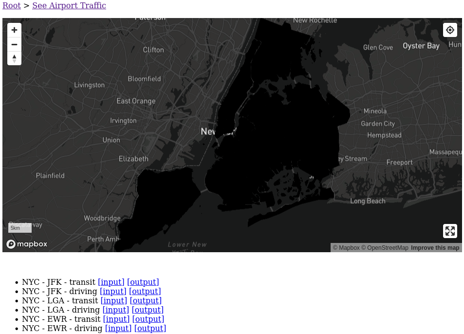

Add a random value for `t` to each polygon to see the district boundaries more clearly. We vary `t` from 1 to 60 because that we defined `fill-color` to expect values from 1 to 60.

```python
from random import choice

for feature in features:
    feature['properties'] = {'t': choice(range(1, 60))}
```

Relaunch the development server by clicking the `Stop` button in the CrossCompute sidebar in JupyterLab and clicking `Launch` again. You should see each district painted randomly.

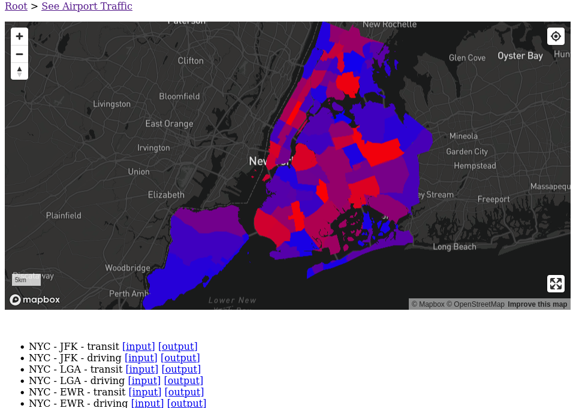

Change the update interval to 10 seconds in `automate.yml` to see the map colors update in real-time.

```yaml
environment:
  interval: 10 seconds
```

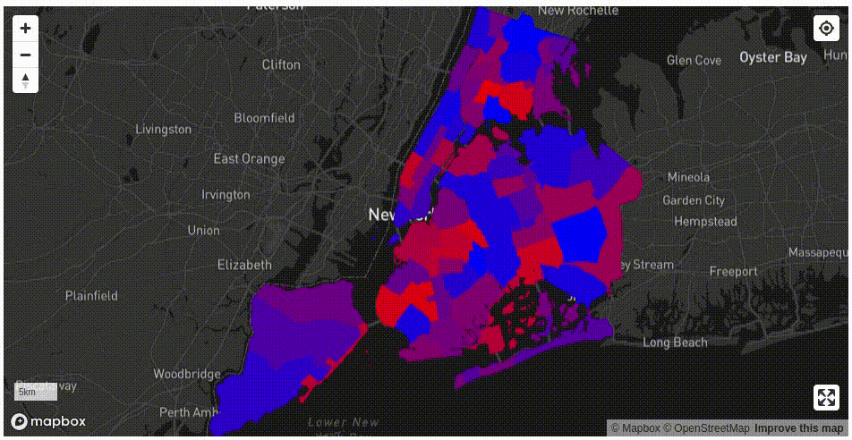

## Phase 2: Add Time Histogram

Next, we add a histogram to show the distribution of travel times.

```python
import matplotlib.pyplot as plt

ts = [_['properties']['t'] for _ in features]
plt.hist(ts, bins=10)
```

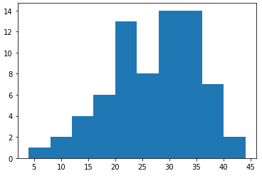

Add some labels.

```python
travel_name = {
    'driving': 'car',
    'transit': 'public transit',
}[travel_mode]
plt.hist(ts, bins=10)
plt.title(f'Time to {destination_address} by {travel_name.title()}')
plt.xlabel(f'minutes')
```

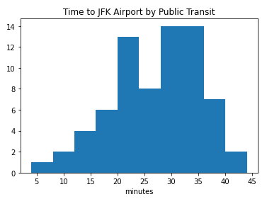

Add a color map.

```python
import matplotlib.pyplot as plt
from matplotlib.colors import LinearSegmentedColormap

REFERENCE_TIME_IN_MINUTES = 60

n, bins, patches = plt.hist(ts, bins=10)
bin_centers = 0.5 * (bins[:-1] + bins[1:])
color_indices = bin_centers / REFERENCE_TIME_IN_MINUTES
color_map = LinearSegmentedColormap.from_list('', ['blue', 'red'])
for i, p in zip(color_indices, patches):
    plt.setp(p, 'facecolor', color_map(i))
plt.title(f'Time to {destination_address} by {travel_name.title()}')
plt.xlabel(f'minutes')
```

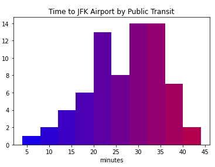

Adjust dimensions, remove padding and save!

```python
import matplotlib.pyplot as plt
from matplotlib.colors import LinearSegmentedColormap

REFERENCE_TIME_IN_MINUTES = 60

px = 1 / plt.rcParams['figure.dpi']
plt.figure(figsize=(800 * px, 200 * px))
n, bins, patches = plt.hist(ts, bins=10)
bin_centers = 0.5 * (bins[:-1] + bins[1:])
color_indices = bin_centers / REFERENCE_TIME_IN_MINUTES
color_map = LinearSegmentedColormap.from_list('', ['blue', 'red'])
for i, p in zip(color_indices, patches):
    plt.setp(p, 'facecolor', color_map(i))
plt.title(f'Time to {destination_address} by {travel_name.title()}')
plt.xlabel(f'minutes')
plt.tight_layout()
plt.savefig(output_folder / 'histogram.png')
```

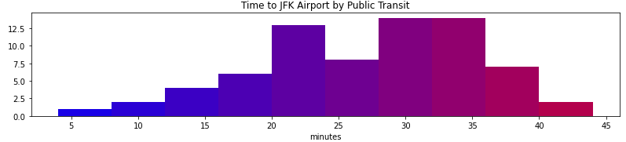

## Phase 3: Compute Travel Times

Finally, we will use the [Google Distance Matrix API](https://developers.google.com/maps/documentation/distance-matrix) to compute travel time to the airport from each district. **You need a valid `GOOGLE_KEY` enabled with the [Distance Matrix API](https://developers.google.com/maps/documentation/distance-matrix) to complete this phase**.

Add the `GOOGLE_KEY` environment variable to `automate.yml`. Remember to increase the dashboard update interval to `8 hours` to conserve your Google API request quota. You might need to restart JupyterLab if you forgot to export `GOOGLE_KEY` before starting JupyterLab.

```yaml
environment:
  variables:
    - id: GOOGLE_KEY
  interval: 8 hours
```

Add the following snippets to `run.ipynb`.

```python
from os import getenv

GOOGLE_KEY = getenv('GOOGLE_KEY')
```

```python
import json

with (input_folder / 'variables.dictionary').open('rt') as f:
    d = json.load(f)
districts_uri = d['districts_uri']
destination_address = d['destination_address']
travel_mode = d['travel_mode']
```

```python
import requests

def get_travel_packs(origin_strings, destination_strings):
    endpoint_uri = 'https://maps.googleapis.com/maps/api/distancematrix/json'
    origins_string = '|'.join(origin_strings)
    destinations_string = '|'.join(destination_strings)
    uri = f'{endpoint_uri}?origins={origins_string}&destinations={destinations_string}&key={GOOGLE_KEY}'
    response = requests.get(uri)
    d = response.json()
    if d['status'] != 'OK':
        print(d)
    origin_addresses = d['origin_addresses']
    travel_packs = []
    for origin_address, row in zip(origin_addresses, d['rows']):
        travel_packs.append((
            origin_address,
            row['elements'][0]['duration']['value']))
    return travel_packs
```

### Use Representative Points

```python
from shapely.geometry import GeometryCollection, shape
geometry = shape(features[0]['geometry'])
GeometryCollection([geometry.representative_point(), geometry])
```

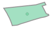

```python
origin_points = []
origin_indices = []
for index, feature in enumerate(features):
    geometry = shape(feature['geometry'])
    sample_points = [geometry.representative_point()]
    origin_points.extend(sample_points)
    origin_indices.extend([index] * len(sample_points))
```

```python
def split(l, s):
    l = list(l)
    for i in range(0, len(l), s):
        yield l[i:i + s]
```

```python
from shapely.geometry import Point

def get_coordinate_string(point):
    return ','.join(str(_) for _ in reversed(point.coords[0]))

get_coordinate_string(Point(0, 1))
```

```python
import math

GOOGLE_DISTANCE_MATRIX_MAXIMUM_COUNT = 25
time_packs = []
destination_strings = [destination_address]

for some_origin_packs in split(zip(
    origin_points,
    origin_indices,
), GOOGLE_DISTANCE_MATRIX_MAXIMUM_COUNT):
    some_origin_points, some_origin_indices = zip(*some_origin_packs)
    origin_strings = [get_coordinate_string(_) for _ in some_origin_points]
    travel_packs = get_travel_packs(origin_strings, destination_strings)
    for index, (origin_address, time_in_seconds) in zip(some_origin_indices, travel_packs):
        time_packs.append((origin_address, time_in_seconds))
        feature = features[index]
        feature['properties'] = {'t': math.ceil(time_in_seconds / 60)}
```

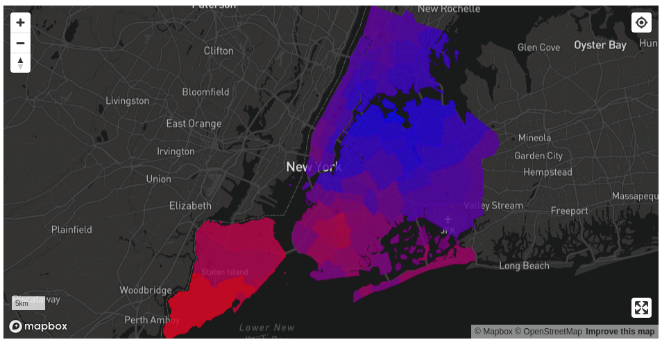

### Use Random Points

We experimented with using random points within each geometry to estimate average travel time from each district. We decided not to use random points because it would create too much variability between runs.

```python
import random
from shapely.geometry import MultiPoint, Point
from shapely.ops import unary_union

def make_random_points(region_geometry, target_count):
    points = []
    minimum_x, minimum_y, maximum_x, maximum_y = region_geometry.bounds
    while len(points) < target_count:
        # Generate random points inside bounds
        random_points = [Point(
            random.uniform(minimum_x, maximum_x),
            random.uniform(minimum_y, maximum_y),
        ) for _ in range(target_count)]
        # Retain points inside region
        collection = unary_union(random_points + points)
        intersection = collection.intersection(region_geometry)
        if intersection.type == 'Point':
            points = [intersection]
        else:
            points = list(intersection.geoms)
    # Trim if there are too many
    return points[:target_count]

from shapely.geometry import GeometryCollection
geometry = shape(features[0]['geometry'])
GeometryCollection(make_random_points(geometry, 3) + [geometry])
```

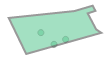

### Use Grid Points

We experimented with using grid points within each geometry to estimate average travel time from each district. We used the `h3` package to generate the grid points. However, grid points would greatly increase the number of Google Distance Matrix API calls. We could offset this by updating the dashboard less frequently. In the end, we decided that it is more important to have the dashboard updated more often than for it to be more accurate.

```python
import h3

def make_grid_points(geometry, resolution):
    xys = []
    geometries = geometry.geoms if hasattr(geometry, 'geoms') else [geometry]
    for g in geometries:
        if g.area < 0.0001:
            continue
        hexs = h3.polyfill(g.__geo_interface__, resolution, geo_json_conformant=True)
        if len(hexs) > 1:
            xys.extend(tuple(reversed(h3.h3_to_geo(_))) for _ in hexs)
        else:
            xys.append(g.representative_point().coords[0])
    return [Point(_) for _ in xys]

geometry = shape(features[0]['geometry'])
GeometryCollection(make_grid_points(geometry, 8) + [geometry])
```

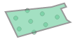

## Phase 4: Embed in Website

You can now deploy and embed this dashboard in your website. Click the embed icon and copy the code snippet. Paste the code snippet into your website.


- [See more tutorials](../README.md)
- [Learn about the framework](../../README.md)
