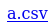
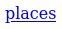
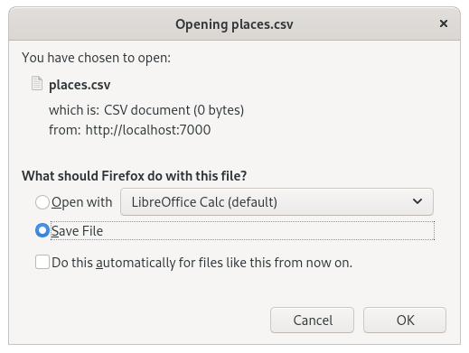

# Link View

Use `view: link` to render a link for downloading a variable's data.



```yaml
output:
  variables:
    - id: a
      view: link
      path: a.csv
```

By default, the view will render a link with the file name as the link text. You can configure both the link text and downloaded file name.





```yaml
output:
  variables:
    - id: a
      view: link
      path: a.csv
      configuration:
        text: places
        name: places.csv
```
