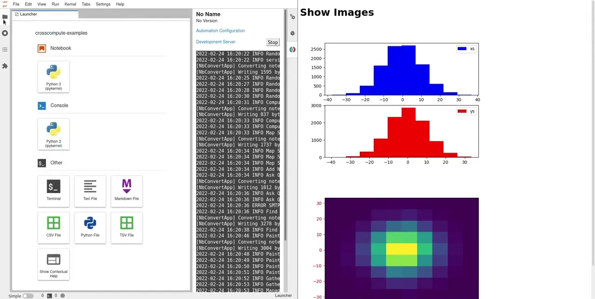
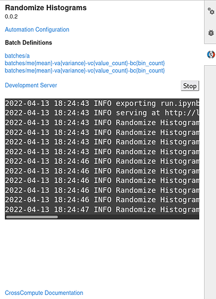

# Editing Extension

Prototype your analytics in JupyterLab with the CrossCompute extension.





## Installation

```bash
pip install \
    crosscompute-printers-pdf \
    jupyterlab-crosscompute
```

## Example

```bash
cd ~/Projects
git clone https://github.com/crosscompute/crosscompute-examples --recursive

cd ~/Projects/crosscompute-examples
find . -name setup.sh -exec bash '{}' ';'

jupyter lab
```

Navigate to a folder containing an automation, then click **Launch** to start the development server.
