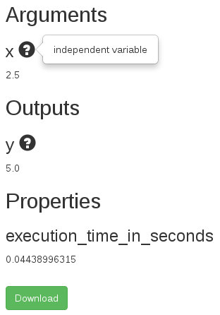
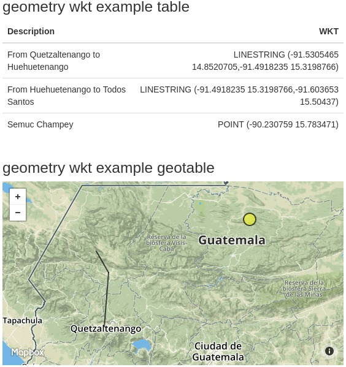

Selected recipes in Python
==========================
Although we have used Python for our examples, you can easily adapt these recipes to command-line scripts written in other programming languages.


Write configuration file
------------------------
In the simplest case, you have a command-line script and you want to capture its standard output.  Here is an example of such a script.

.. literalinclude:: examples/python/divide-floats/run.py
   :language: python

Running the script produces the following output.  ::

    $ python run.py 4 5
    4 divided by 5 is 0.8

To wrap the script in a web interface, we write a configuration file.

.. literalinclude:: examples/python/divide-floats/cc.ini
   :language: ini


Specify tool name
`````````````````
The configuration file must end with the extension ``.ini`` and contain a section that starts with the word ``crosscompute``, optionally followed by the name of the tool.

.. code-block:: ini

    [crosscompute our-simple-one-function-calculator]

If you do not specify a tool name, then the name of the tool will be the name of the folder containing the configuration file.


.. _specify_command_line_arguments:

Specify command-line arguments
``````````````````````````````
The most important option in the configuration file is the ``command_template``, which tells CrossCompute how to run your script.

Here, we use ``python`` to execute ``run.py`` with ``x`` and ``y`` as arguments.

.. literalinclude:: examples/python/divide-floats/cc.ini
   :language: ini
   :lines: 2

If your command is long, you can split it across multiple lines.

.. code-block:: ini

    command_template = bash script-with-many-arguments.sh
        {first_argument}
        {second_argument}
        {third_argument}


.. _capture_standard_streams:

Capture standard streams
````````````````````````
CrossCompute parses but does not save standard output or standard error from the script, unless requested to do so explicitly.

.. literalinclude:: examples/python/divide-floats/cc.ini
   :language: ini
   :lines: 3-4


Specify default values for arguments
````````````````````````````````````
When executed without arguments, ``crosscompute run`` uses the default values specified in the configuration file, which can save time during development.

.. literalinclude:: examples/python/divide-floats/cc.ini
   :language: ini
   :lines: 5-6

Additionally, ``crosscompute serve`` uses the default values to populate the tool form.  If an argument name ends with ``_path`` and a default file path is specified, the web app will show the contents of the file in the form.  For example, this configuration file

.. literalinclude:: examples/python/get-size/cc.ini
   :language: ini

will render the following form.


Run tool
````````
First, check that the application development framework is installed on your system.  ::

    $ crosscompute
    usage: crosscompute {serve,run} ...
    crosscompute: error: too few arguments

Then execute ``crosscompute run`` in the parent folder or same folder as your configuration file.  ::

    $ crosscompute run
    [tool_definition]
    tool_name = divide-floats
    configuration_path = ~/Experiments/divide-floats/cc.ini
    command = python run.py 10 3

    [result_arguments]
    x = 10
    y = 3
    target_folder = /tmp/divide-floats/results/1

    [standard_output]
    10 divided by 3 is 3.33333333333

    [result_properties]
    standard_output = 10 divided by 3 is 3.33333333333
    execution_time_in_seconds = 0.0374681949615

The ``target_folder`` contains the result generated from this run.  Each subsequent run will save the result in a new ``target_folder``.  ::

    $ ls /tmp/divide-floats/results/1
    result.cfg  standard_output.log

If there is more than one tool, you will need to specify the tool name explicitly.  ::

    $ crosscompute run divide-floats


Override default values
```````````````````````
Sometimes, you might want to override default argument values.  Use ``--help`` to show the required syntax.  ::

    $ crosscompute run --help
    usage: divide-floats [-h] [--x X] [--y Y]

    optional arguments:
    -h, --help  show this help message and exit
    --x X
    --y Y

If our script terminates unexpectedly, ``crosscompute run`` will show any errors.  In this case, the standard error stream is rendered twice because ``show_standard_error = True``.  ::

    $ crosscompute run --y 0
    [tool_definition]
    tool_name = divide-floats
    configuration_path = ~/Experiments/divide-floats/cc.ini
    command = python run.py 10 0

    [result_arguments]
    x = 10
    y = 0
    target_folder = /tmp/divide-floats/results/2

    [standard_error]
    Traceback (most recent call last):
      File "run.py", line 3, in <module>
        print('{} divided by {} is {}'.format(x, y, float(x) / float(y)))
    ZeroDivisionError: float division by zero

    [result_properties]
    return_code = 1
    standard_error = 
    Traceback (most recent call last):
      File "run.py", line 3, in <module>
        print('{} divided by {} is {}'.format(x, y, float(x) / float(y)))
    ZeroDivisionError: float division by zero
    execution_time_in_seconds = 0.166897058487


Serve tool
``````````
Once you are satisfied that the script is configured properly, execute ``crosscompute serve`` to serve the web app.  ::

    $ crosscompute serve

.. image:: _static/divide-floats-tool.png

Click **Run** to see the result.


Start from a scaffold
---------------------
To save time, you can start building your tool from a pre-defined scaffold, `courtesy of Pyramid <http://docs.pylonsproject.org/projects/pyramid/en/latest/narr/scaffolding.html>`_.  ::

    $ pcreate -l
    Available scaffolds:
    alchemy:                 Pyramid SQLAlchemy project using url dispatch
    posts:                   InvisibleRoads Posts
    pyramid_jinja2_starter:  pyramid jinja2 starter project
    starter:                 Pyramid starter project
    tool:                    CrossCompute Tool
    zodb:                    Pyramid ZODB project using traversal

The ``tool`` scaffold will clone the basic tool scaffold.  ::

    $ pcreate -s tool your-tool-name

Here is the basic tool scaffold configuration file.

.. literalinclude:: examples/python/start-tool/cc.ini
   :language: ini

Here is the basic tool scaffold script.

.. literalinclude:: examples/python/start-tool/run.py
   :language: python


.. _save_output_files:

Save output files
-----------------
The ``target_folder`` argument is a special keyword that specifies the folder where your script can save files for the user to download.

.. literalinclude:: examples/python/save-text/cc.ini
   :language: ini

If your script saves files in the folder, then the user will have access to those files by downloading the archive on the result page.

.. literalinclude:: examples/python/save-text/run.py
   :language: python

Run the script by typing ``crosscompute run`` in the same folder as ``cc.ini``.  ::

    $ crosscompute run
    [tool_definition]
    tool_name = save-text
    configuration_path = ~/Experiments/save-text/cc.ini
    command = python run.py /tmp/save-text/results/1

    [result_arguments]
    target_folder = /tmp/save-text/results/1

    [result_properties]
    execution_time_in_seconds = 0.0495231151581

    $ ls /tmp/save-text/results/1
    result.cfg  xyz.txt

Serve the script by typing ``crosscompute serve`` in the same folder as ``cc.ini``.  ::

    $ crosscompute serve

Run the tool, then click ``Download`` to receive an archive containing the result configuration as well as any files saved in the ``target_folder``.


Additionally, the tool will be able to render the content of those files for selected data types (see :ref:`specify_data_types_for_result_properties`).  Here is a slightly more involved example that counts the number of each non-whitespace character in a text file.

.. literalinclude:: examples/python/count-characters/cc.ini
   :language: ini

The script tells CrossCompute to render the output file as a table by printing a statement in the form ``xyz_table_path = abc.csv``.

.. literalinclude:: examples/python/count-characters/run.py
   :language: python

Running the tool using ``crosscompute serve`` renders the desired table.


Specify data types for tool arguments
-------------------------------------
Specifying the data type of a tool argument provides the following benefits.

- The script can assume that an argument matches its specified data type.  For example, the script below can assume that its first argument is an integer because the framework performs basic integer validation before running the script.
- The corresponding web application renders an appropriate query for the tool argument in the form.


The suffix of a tool argument determines its data type.  Specify tool arguments in the ``command_template`` by enclosing argument names in curly brackets (see :ref:`specify_command_line_arguments`).  In the configuration file below, the arguments are ``some_count`` (integer), ``a_text_path`` (text), ``a_table_path`` (table).

.. literalinclude:: examples/python/load-inputs/cc.ini
   :language: ini

Only the configuration file ``command_template`` is relevant when determining tool argument data types.  The script does not have to use the same argument names.

.. literalinclude:: examples/python/load-inputs/run.py
   :language: python

Install the relevant data type plugins.  CrossCompute matches argument name endings to suffixes registered by installed data types.  ::

    pip install -U crosscompute-integer
    pip install -U crosscompute-text
    pip install -U crosscompute-table

You can also register your own data type plugins.  For examples on how to write data type plugins, please see https://github.com/crosscompute/crosscompute-types.


.. _specify_data_types_for_result_properties:

Specify data types for result properties
----------------------------------------
Specifying the data type of a result property provides the following benefits.

- The corresponding web application renders an appropriate value for the result property in the form.

First, include a ``target_folder`` in the ``command_template``.

.. literalinclude:: examples/python/save-outputs/cc.ini
   :language: ini

Then, save output files in the ``target_folder`` (see :ref:`save_output_files`) and print statements to standard output in the form ``abc_suffix = xyz`` where the suffix corresponds to the desired data type.

.. literalinclude:: examples/python/save-outputs/run.py
   :language: python
   :emphasize-lines: 11,19,25,35

The example above contains the following print statements::

    print('an_integer = ...')       # Render integer
    print('a_table_path = ...')     # Render table
    print('an_image_path = ...')    # Render image
    print('a_geotable_path = ...')  # Render geoimage (map)

Serve and run the tool to render the result.  ::

    $ crosscompute serve


.. image:: _static/save-outputs-geotable.png


Log errors and warnings
-----------------------
There are two ways that you can communicate an error or warning to the user:

- Option 1: Set ``show_standard_error = True`` in the configuration file (see :ref:`capture_standard_streams`).  The advantage is that this does not require changes in the script.  The disadvantage is that you might show proprietary or unnecessary information.
- Option 2: Write to standard error in the format ``abc = xyz``.  The advantage is that this provides finer control of the information that you share with the user.  The disadvantage is that you will have to make sure that your messages are in the format ``abc = xyz``.  Note that the spaces around the equal sign are important.

.. literalinclude:: examples/python/divide-integers/cc.ini
   :language: ini

.. literalinclude:: examples/python/divide-integers/run.py
   :language: python
   :emphasize-lines: 8


In Python, you can use the ``exit`` system function for errors (which will set a non-zero return code) and use the ``print_error`` convenience function (which simply prints to standard error) for warnings.  ::

    from invisibleroads_macros.log import print_error
    print_error('xyz.warning = cave canem')


Specify dependencies
--------------------
You can put dependencies in the configuration file.  Currently, the framework supports dependencies for the following languages:

- Python

.. literalinclude:: examples/python/get-locations/cc.ini
   :language: ini
   :emphasize-lines: 6-7


Specify help popovers
---------------------
A help popover is a helpful description that appears when the user touches a question mark icon.  To add a help popover to a tool argument or result property, use the following syntax in the configuration file::

    your_argument_name.help = helpful description
    your_result_property.help = another description

Here is an example configuration file.

.. literalinclude:: examples/python/show-popovers/cc.ini
   :language: ini
   :emphasize-lines: 4-5

And here is the resulting interface.




Serve multiple tools
--------------------
There are two ways to organize your files when serving multiple tools:

- Option 1: Have multiple configuration files in separate folders and launch ``crosscompute serve`` from the parent folder.  ::

    .
    ├── count-characters
    │   ├── cc.ini
    │   └── run.py
    └── divide-floats
        ├── cc.ini
        └── run.py

- Option 2: Have a single configuration file with multiple sections.

.. literalinclude:: examples/python/configure-tools/cc.ini
   :language: ini


Show tables
-----------
First, make sure you have installed the appropriate data type plugin.  ::

    pip install -U crosscompute-table

Then, save the table in ``target_folder``.  ::

    from os.path import join
    target_path = join(target_folder, 'points.csv')
    csv_writer = csv.writer(open(target_path, 'w'))
    csv_writer.writerow(['x', 'y'])
    csv_writer.writerow([100, 100])

Finally, print the table path to standard output, making sure to specify the data type suffix.  ::

    print('point_table_path = ' + target_path)

Here is an example configuration file.

.. literalinclude:: examples/python/make-points/cc.ini
   :language: ini

Here is an example script.

.. literalinclude:: examples/python/make-points/run.py
   :language: python
   :emphasize-lines: 10,18

::

    $ crosscompute serve make-points


Show images
-----------
First, make sure you have installed the appropriate data type plugin.  ::

    pip install -U crosscompute-image

Then, save the image in ``target_folder``.  If you are using ``matplotlib`` to generate the image, then ensure that the script will run without a display by specifying the ``Agg`` backend.  ::

    import matplotlib
    matplotlib.use('Agg')

    from matplotlib import pyplot as plt
    from os.path import join

    target_path = join(target_folder, 'points.png')
    figure = plt.figure()
    # Generate your plot here
    figure.savefig(target_path)

Finally, print the image path to standard output, making sure to specify the data type suffix.  ::

    print('point_image_path = ' + target_path)

Here is an example configuration file.

.. literalinclude:: examples/python/show-plot/cc.ini
   :language: ini

Here is an example script.

.. literalinclude:: examples/python/show-plot/run.py
   :language: python
   :emphasize-lines: 1-2,20,23

::

    $ crosscompute serve show-plot


Show maps
---------
The ``geotable`` data type uses the table name and column names to render the map (see :ref:`render_geometries`).

First, make sure you have installed the appropriate data type plugin.  ::

    pip install -U crosscompute-geotable

Then, save a table with spatial coordinates in ``target_folder``.  If you are using `pandas <http://pandas.pydata.org>`_, then you can use `to_csv <http://pandas.pydata.org/pandas-docs/stable/io.html#io-store-in-csv>`_, `to_json <http://pandas.pydata.org/pandas-docs/stable/io.html#io-json-writer>`_, `to_msgpack <http://pandas.pydata.org/pandas-docs/stable/io.html#io-msgpack>`_ to save in CSV, JSON, MSGPACK format, respectively.  ::

    from pandas import DataFrame
    target_path = join(target_folder, 'memory.csv')
    memory_table = DataFrame([
        ('Todos Santos', 15.50437, -91.603653),
        ('Semuc Champey', 15.783471, -90.230759),
    ], columns=['Description', 'Latitude', 'Longitude'])
    map_table.to_csv(target_path, index=False)

Finally, print the table path to standard output, making sure to specify the data type suffix.  ::

    print('memory_table_path = ' + target_path)

Here is an example configuration file.

.. literalinclude:: examples/python/show-maps/cc.ini
   :language: ini

Here is an example script.

.. literalinclude:: examples/python/show-maps/show_map.py
   :language: python
   :emphasize-lines: 9-11

Here is an example table that specifies feature radius and color.

.. literalinclude:: examples/python/show-maps/locations.csv

::

    $ crosscompute serve show-map
    $ crosscompute serve show-map-examples


Note that clicking on a feature in the map will show its attributes in a table.


.. _render_geometries:

Render geometries
`````````````````
If the table has a column name ending in ``_latitude`` and a column name ending in ``_longitude``, then each row will render as a point in the map.


If the table has a column name ending in ``_wkt``, then each row will render as the corresponding `WKT geometry <https://en.wikipedia.org/wiki/Well-known_text>`_.



Here are the recognized WKT geometry types:

- POINT
- LINESTRING
- POLYGON
- MULTIPOINT
- MULTILINESTRING
- MULTIPOLYGON


Vary background
```````````````
To change the map background, specify the desired tile layer in the table name.  ::

    a_streets_satellite_geotable
    an_outdoors_geotable
    a_pirates_geotable


Here are the available backgrounds, `courtesy of Mapbox <https://www.mapbox.com/developers/api/maps/>`_:

- streets
- light
- dark
- satellite
- streets-satellite
- wheatpaste
- streets-basic
- comic
- outdoors
- run-bike-hike
- pencil
- pirates
- emerald
- high-contrast


Specify radius
``````````````
If the table has a column that starts with ``RadiusInMeters`` or ``radius_in_meters`` or ``radius-in-meters`` or ``radius in meters`` or some variation thereof and if the row is a point geometry, then the value for the row in that column will render as the point radius in meters.  Use this setting if it is important to visualize the real-world radius of each point.


If the table has a column that starts with ``RadiusInPixels``, ``radius_in_pixels``, ``radius-in-pixels`` or ``radius in pixels`` and if the row is a point geometry, then the value for the row in that column will render as the point radius in pixels.  This setting ensures that the point will remain the same size on the screen independent of the map zoom level.


Sometimes it can be convenient to scale the radius to a specific range.  Use the syntax ``RadiusInPixelsRange10-100``, ``radius_in_pixels_range_10_100``, ``radius-in-pixels-range-10-100`` or ``radius in pixels range 10 100``.


If there are multiple rows for a given geometry, then you can specify how to combine the values to compute the radius.  ::

    RadiusInPixelsFromMean
    RadiusInPixelsRange10-100FromMean
    RadiusInPixelsFromSum
    RadiusInPixelsRange10-100FromSum

.. image:: _static/show-map-examples-radius-pixel-mean.png


Specify fill color
``````````````````
Add a column named ``FillColor`` to specify the fill color of the geometry, courtesy of the `Matplotlib color module <http://matplotlib.org/api/colors_api.html#module-matplotlib.colors>`_.  Here are examples of valid values in the ``FillColor`` column.  ::

    # b blue, g green, r red, c cyan, m magenta, y yellow, k black, w white
    r 

    # gray shade specified as decimal between 0 and 1
    0.1

    # hex string
    #ff565f

    # color name
    purple

If there are multiple rows for a given geometry, then you can specify how to combine the values to compute the fill color.  ::

    FillColorFromMean
    FillColorFromSum


Use color scheme
````````````````
If the column name starts with ``Fill``, followed by the name of a recognized color scheme, then the geometry will normalize and render the value for the row in that column to the specified color scheme.


Here are the recognized color schemes, courtesy of `ColorBrewer <http://colorbrewer2.org>`_:

- blues
- brbg
- bugn
- bupu
- gnbu
- greens
- greys
- oranges
- orrd
- paired
- pastel1
- piyg
- prgn
- pubu
- pubugn
- puor
- purd
- purples
- rdbu
- rdgy
- rdpu
- rdylbu
- rdylgn
- reds
- set1
- set3
- spectral
- ylgn
- ylgnbu
- ylorbr
- ylorrd

If there are multiple rows for a given geometry, then you can specify how to combine the values to compute the fill color.  ::

    FillBluesFromMean
    FillBluesFromSum


Deploy geotable-based tool locally
``````````````````````````````````
If you are deploying your geotable-based tool on a local server, then you can take advantage of higher API rate limits for map tiles by specifying a `Mapbox access token <https://www.mapbox.com/help/define-access-token/>`_.

Set the ``MAPBOX_TOKEN`` environment variable before running the server.  Here is the syntax in Linux::

    $ export MAPBOX_TOKEN=YOUR-ACCESS-TOKEN
    $ crosscompute serve
